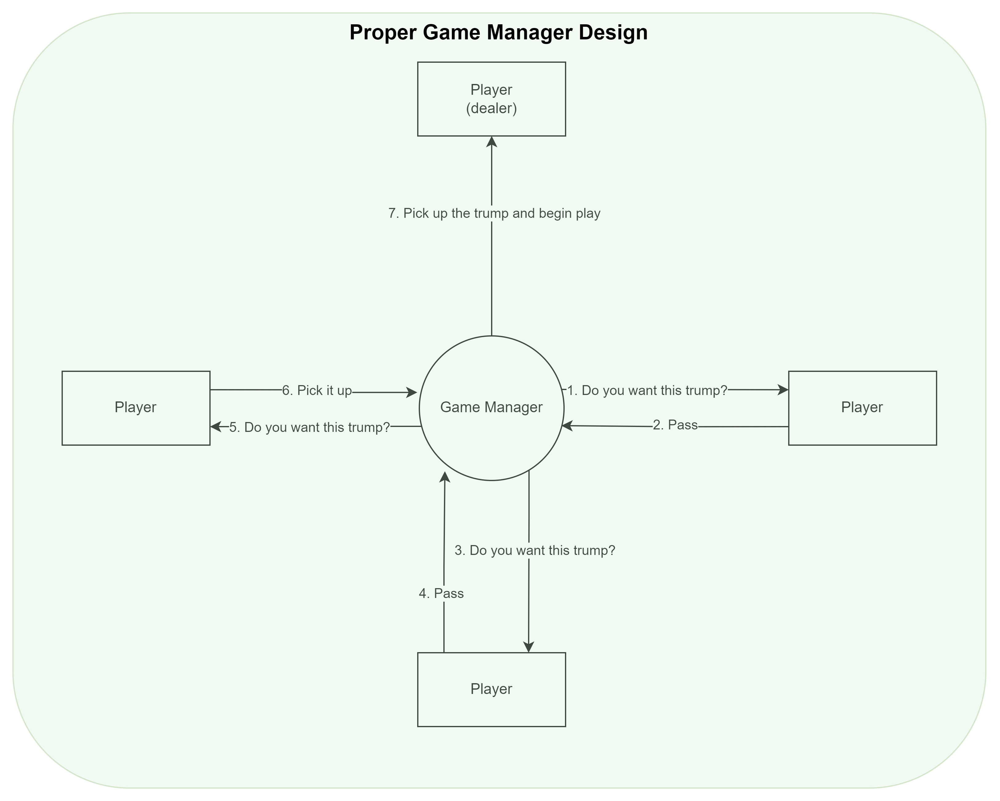
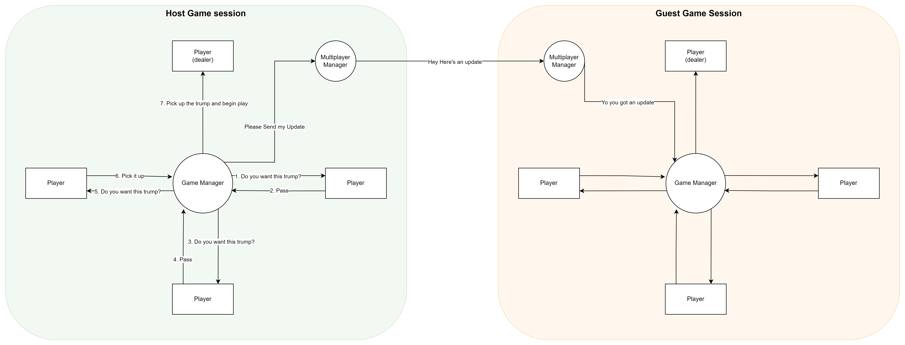

# Game Manager Design

### Note

It is important to note that this can evolve still. This doc is simply here to show what we currently have and explain so that we're on all on the same page.

As clem works on game logic and someone moves to player logic, we will all need to work very closely to iron out our data flow. I would love to have a well defined data flow (maybe a sequence chart :) ) to make sure we can all be aware of how things are working. I have a feeling things will get really messy really fast. In light of us just getting started, I left out a lot of specifics on how things would interact with each other for now.

#### Scope of Game Manager

1. Run the game logic.
    * The game manager should be receive all player actions and act accordingly. The alternative would be for player actions to be relayed between players. Rather, it would be easier for a single game manager to do this. See the image below for what I'm somewhat thinking. 

2. Manage the game-related multiplayer functionality.
    * What this means: the gamemanager is going to need two modes. First, <b>host</b> which would be the source of truth for the game state and would be responible for notifiying the <b>guest</b> game manager about game events (card played, trump, trick won, etc). Perhaps we can define some kind of <i>game_state,</i> json object that would make these communications standard. 

    * What this <i><b>doesn't </b></i> mean: Sending animation data to the other players. This game manager would not be responsible for maintaining multiplayer information unrelated to gameplay (player aniumation, card animation, etc)
        * There may be a need for a <b>multiplayer</b> controller which would handle this information and the game controller could use to send it's data through. Centralizing any multiplayer interaction would be good to aim for. (Kurt, correct me if I'm wrong in this idea for a design)

#### Preliminary Blueprint Design and other Relevant Components

##### Quick note: Don't get too caught up here. This is definitely going to change soon, but this can be good reference material in the future to see what all of the differnet variables, functions, and stuff mean in the game manager.

* Local Variables: <b>`<VAR_NAME>: <VAR_TYPE>`</b>...this should be the variables that aren't neccarily a hard reference to another object in the game. 
    * <b>`currentTrump: cardSuit`</b>: Game manager will need to know what the current trump in order to assign trick properly.

    * <b>`currentLead: cardSuit`</b>: need to know the led card to assign trick properly

    * <b>`currentTricks: int`</b>: Will need to know who won how many tricks at the moment so that end point can be assigned (euchre, loner, normal)

    * <b>`currentTrick: int`</b>: There will be max of 5. This would help make sure we're not waiting forever. 

    * <b>`currentPlayer: player`</b>: Who's turn is it.
    
    * <b>`acceptingAction: boolean`</b>: This might be nice to have. It would be something that the card blueprint could check to see whether or not a card can be played at any given moment. There mmay be times where we don't want players to play cards (e.g. when it's not their turn)

    * <b>`currentScore: int`</b>: Score of the entire game.
    
    * <b>`deck: deck`</b>: We will need to discuss this one. But I'm thinking about having this be the "sticky" card collector. Players can throw all the cards to this deck and it would slowly grow as more cards are added. Cards can then be spawned from this deck's location during dealing. This seems like it would be easier to maintain rather than attempting to stack all card actors individually.

* Other object references: <b>`<VAR_NAME>: <VAR_TYPE>`</b>

    * <b>`Players: player[]`</b>: I'm  not too sure where this will come into play, but we will surely need a reference to the players for some reason.

    * <b>`cards: card[]`</b>: This would come in handy when dealing. We can randomly pop one card from this array and spawn it during dealing.

    * Likely some more, but I'm just not sure what would go here atm.

* Functions: <b>`<FUN_NAME>: <PARAMS>`</b>

    * <b>`playCard: card`</b>: This would be the function that the card blueprint (or player blueprint) would call accordingly. The gamemanager can use this as a cue to update it's state accordingly

    * <b>`dealCards: void`</b>: Set up the round. We will need to discuss on how much (if any) user intervention would be needed here. E.g. Do we want users to physically pass out cards?

Link to charts: https://drive.google.com/file/d/16ouEW18taRrafbZrHtFw7gB8rAlfowmz/view?usp=sharing