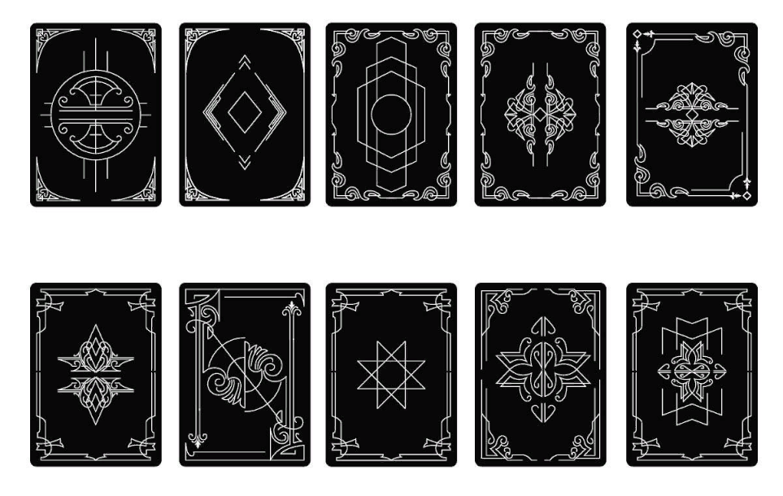
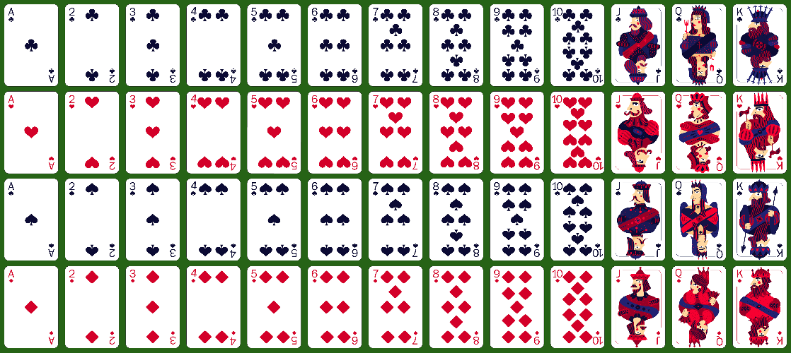

# *Euchre with Friends* Theme Doc

## Overview

Based on the Cards and free assets we can find in the Epic Games Marketplace, we will be focusing on a Medieval Theme for the game.

## Playing Cards

Provided by [cgtrader](https://www.cgtrader.com/free-3d-models/sports/game/playing-cards-deck-of-52-cards).

### Card Backs

### Card Fronts

## Fonts

### Fancy

- [Seagram TFB](https://www.dafont.com/seagram-tfb.font?text=Euchre+with+Friends)

### Simple

- [Linux Libertine](https://www.dafont.com/linux-libertine.font?l%5B%5D=10&l%5B%5D=1&text=Euchre+with+Friends)

## Colors

Not super important, but we can use the following colors for the UI:

## Sounds

### Music

If we are not worried about licensing and just want to use music for the game, we can use the following music:

- [Middle Ages Youtube](https://www.youtube.com/@MiddleAgesMusic)
- [Tavern with Ambiance](https://www.youtube.com/watch?v=O738AtAwacI)

### Ambient

- [Fireplace](https://www.youtube.com/watch?v=S_d3AZwbt6k)

### SFX

We should make these ourselves as they are simple enough to do so. The links go nowhere.

- [Cards Shuffling]()
- [Cards Dealing]()
- [Card Placing]()
